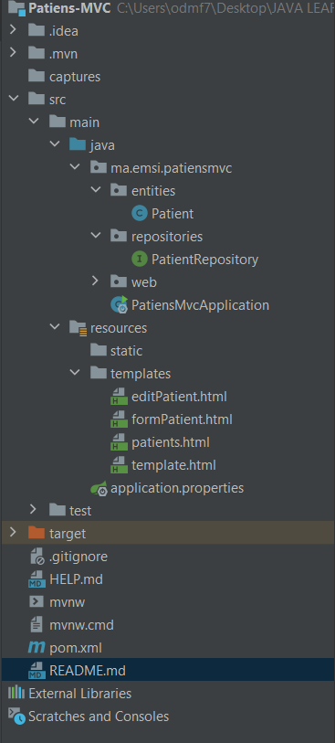
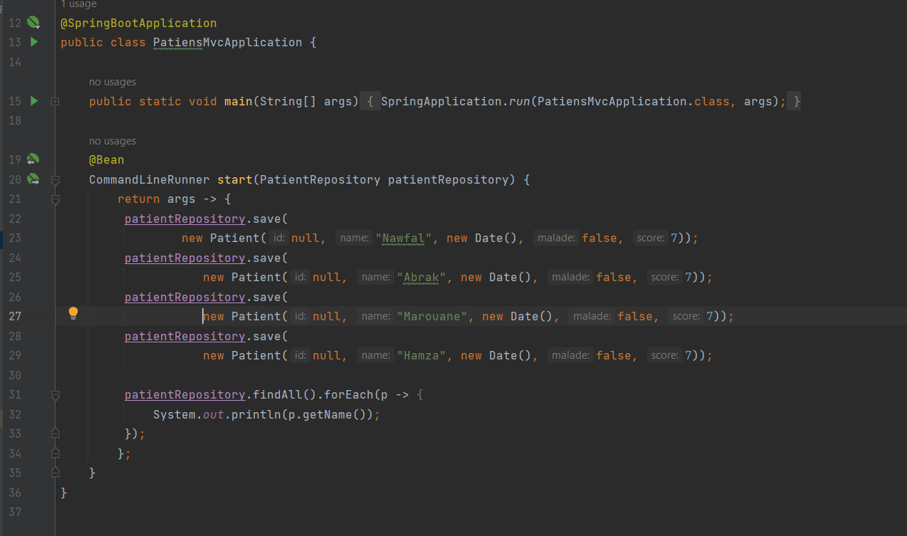
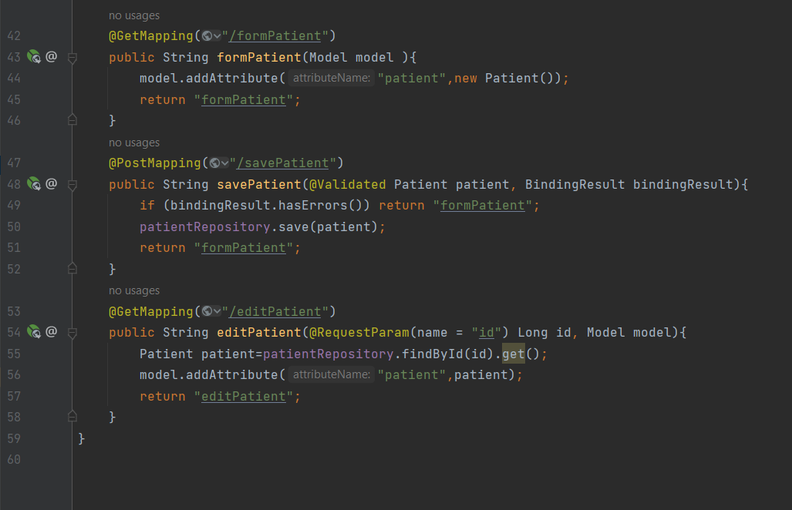
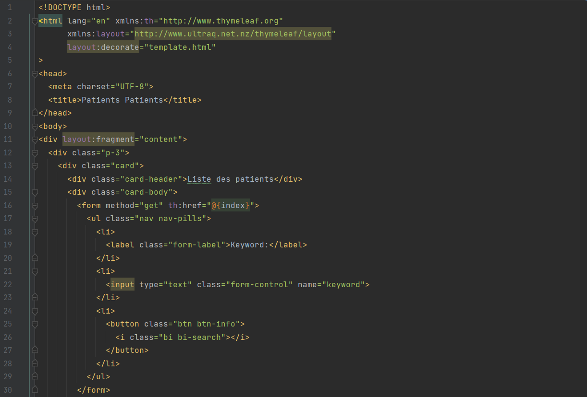
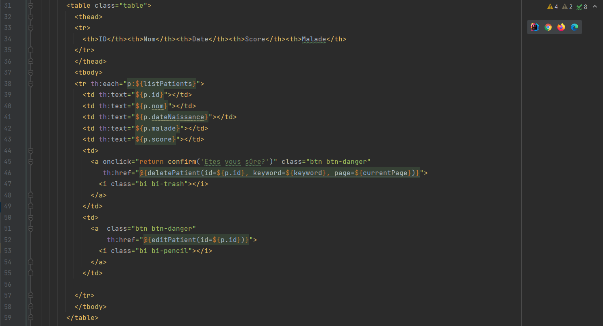
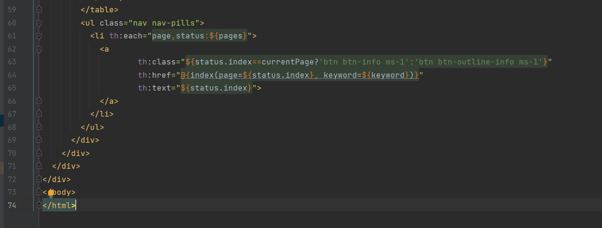
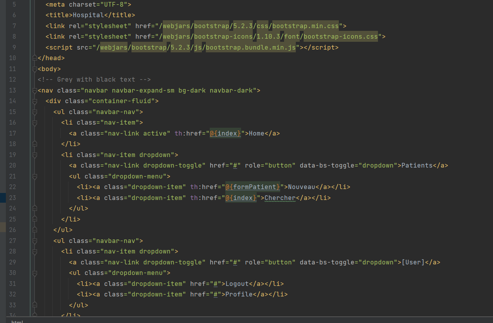
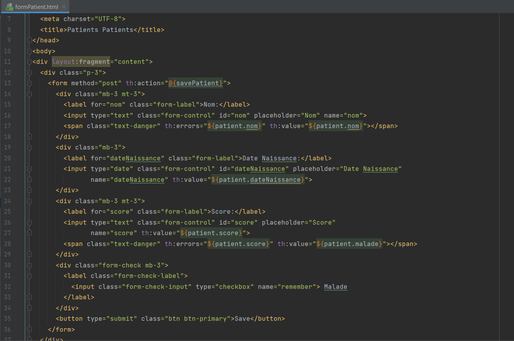
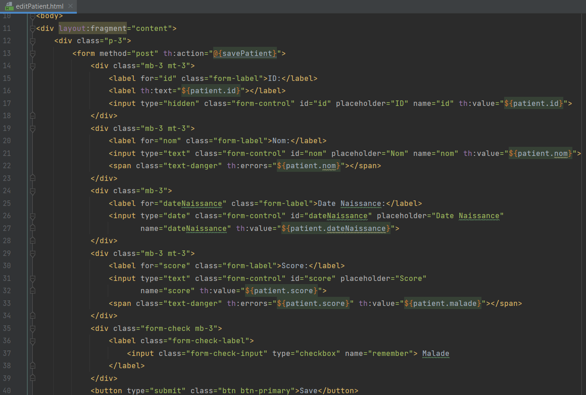

<h1>Spring MVC using Thymeleaf</h1>
 

<h3>To Do :</h3>
<h5>1. Afficher les patients 
2. Faire la pagination 
3. Chercher les patients 
4. Supprimer un patient 
5. Faire des améliorations supplémentaires</h5>

 

<h5>PatientsMvcApplicatiion.java</h5>

<h5>PatientsController.java</h5>

<h5>patients.HTML</h5>

<h5>template.HTML</h5>

<h5>formPatient.HTML</h5>

<h5>editPatient.HTML</h5>

