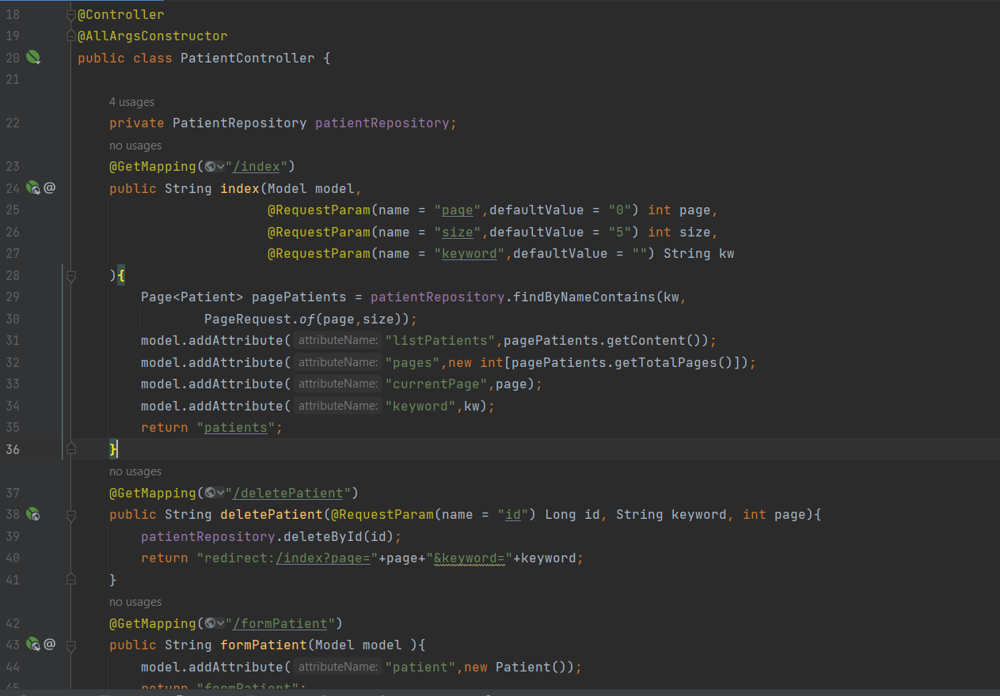

<h1>Spring MVC using Thymeleaf</h1>
 
<h5>Afficher les patients 
Faire la pagination 
Chercher les patients 
Supprimer un patient 
Faire des améliorations supplémentaires</h5>
 

<h5>patients.HTML</h5>

<h5>template.HTML</h5>

<h5>formPatient.HTML</h5>

<h5>editPatient.HTML</h5>
